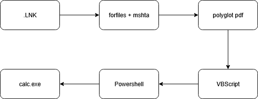

# Bait Shop

Toy project to experiment with lnk phising and pdf polyglots.

the builder.ps1 script generate a valid pdf file that contains an html application (HTA) with obfuscated vbscript. The builder script also generate a lnk file that execute the code contained in the pdf file with mshta.exe.

This kind of phising technique has been used by several threat actors in the past few years, and recent EDRs should easily detect it. It is still a funny and instructive exemple of how certains file formats can be abused to hide malicious payloads.

## Payload execution

1. The lnk file execute the HTA contained in the PDF with `forfiles.exe` and `mshta.exe`.
2. the obfuscated vbscript executes `conhost.exe` to silently run a PowerShell script.
3. the powershell script decypher, decompress and execute the final payload (calc.exe by default)

## ref

- https://www.proofpoint.com/us/blog/threat-insight/call-it-what-you-want-threat-actor-delivers-highly-targeted-multistage-polyglot
- https://arxiv.org/html/2407.01529v1
- https://lolbas-project.github.io

## TODO

- better cli interface
- add other polyglots (pptm, docx)
- better obfuscation lol